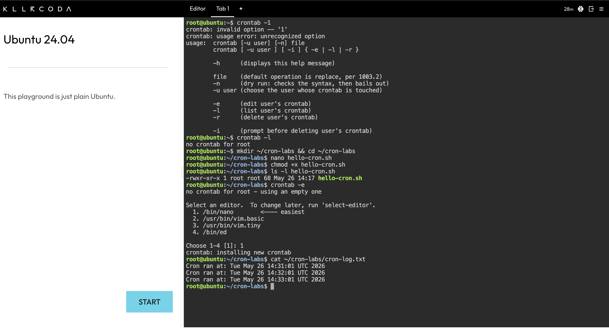
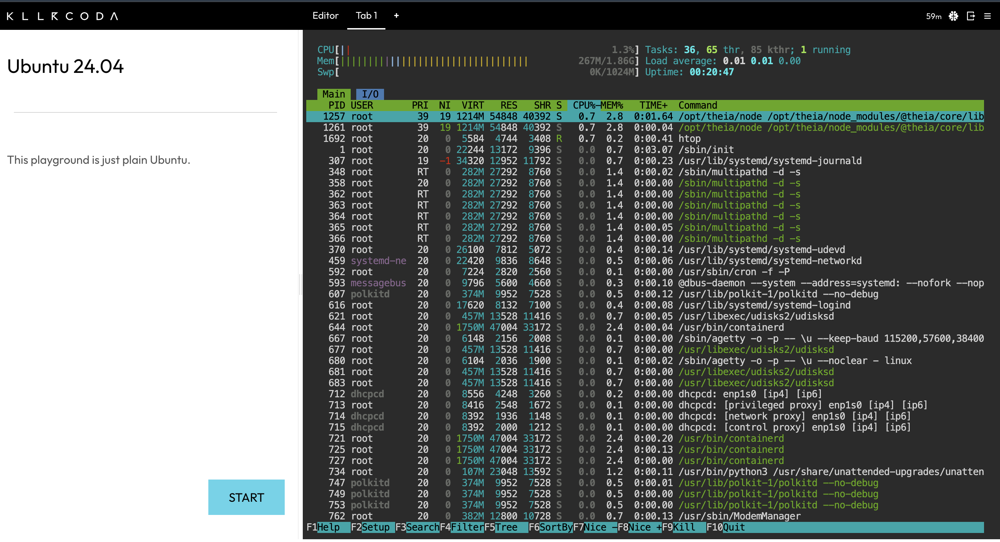
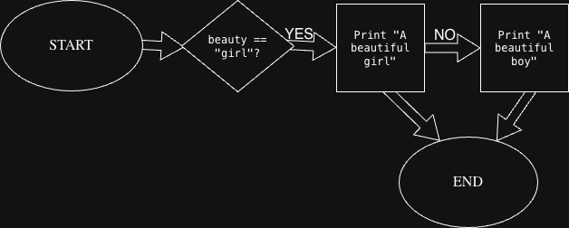

# Azure Learning Journal

Hi, I'm Adebola Shopeju.
I am working through the CloudOps 6-month Azure Architecture program.
I am building toward AZ-900, AI-102, and AZ-104 certifications.
My goal is a remote cloud engineering role.
This repo tracks my labs, scripts, and projects. Updated weekly.

## 📅 Progress Tracker

| Week | Topic | Status |
|------|-------|--------|
| Week 1 | Git, Linux, Azure Portal, Cloud Fundamentals | ✅ Done |
| Week 2 | Linux Services, Cron, Python Basics | ✅ Done |
| Week 3 | Coming soon | 🔄 In progress |

## What's in this repo
Weekly learning logs, lab notes, and technical reflections from the
CloudOps Remote-First Azure Architect Program. Each week
covers new concepts, completed labs, and key insights from hands-on work.

## Weekly Learning Log
### Week 1 — May 2026
**Topics covered:** Git fundamentals, Linux filesystem and permissions,
Git branching and pull requests, Azure Portal, resource groups,
IaaS/PaaS/SaaS, cloud economics (CapEx/OpEx), Azure AI-900 foundations.
**Labs completed:** GitHub repo setup, Linux chmod drill, Azure resource
groups (dev/prod/test), storage accounts with LRS/ZRS, RBAC via Azure CLI.
**Key insight:** I was surprised that chmod permissions are just addition — r=4, w=2, x=1 — once I understood the numbers it all clicked instantly.

## Tools & Stack
VS Code · Azure Portal · GitHub · Azure CLI · Quizlet ·
Draw.io · Microsoft Learn · Bash · NotebookLM

### Week 2 — May 2026 (in progress)
**Topics covered:** systemd and service management, systemctl commands (status/start/stop/enable/disable/journalctl), file permissions in depth (chmod 755/644/600), cron jobs, process management (ps aux, top, htop, kill).
**Labs completed:** systemctl 7-command drill on Killercoda Ubuntu, chmod permissions drill in VS Code terminal, first cron job with timestamped log output, process management with ps/htop/kill by PID.
**Key insight:** Seeing my cron-log.txt fill with timestamps automatically made automation feel real for the first time — the system worked without me touching it.

### Week 2 — Wednesday Python Basics
**Topics covered:** Variables, strings, integers, floats, booleans, print(), for loops, while loops, if/elif/else conditionals.
**Labs completed:** week2_python_basics.py — variables, for loop through students list, while loop counter, if/elif/else conditional.
**Key insight:** A variable is a labelled container. A conditional listens to a condition and acts based on whether it is true or false.

